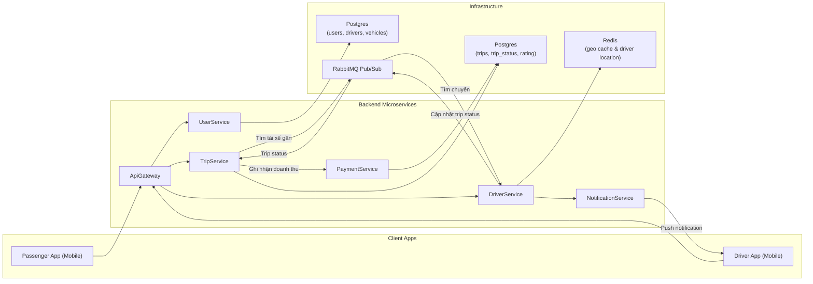

# UIT-Go — ARCHITECTURE.md

**Phiên bản:** v0.1 — Milestone 1 (Demo local)

---

## Mục lục

1. Mục tiêu tài liệu
2. Tóm tắt tiến độ (Milestone 1)
3. Kiến trúc tổng quan
4. Thiết kế chi tiết cho bộ xương microservices

   * UserService
   * TripService (chứa matching tạm thời)
   * DriverService
5. Giao tiếp giữa các service (sequence flows)
6. Triển khai local (Docker Compose)

   * Cấu trúc repo
   * docker-compose.yml (mô tả)
   * Các container và ports
   * Hướng dẫn chạy demo + kiểm thử nhanh
7. API gợi ý & ví dụ curl để chứng minh giao tiếp

   * UserService
   * TripService
   * DriverService
8. Kế hoạch Module A — Scalability & Performance (chi tiết)

   * Mục tiêu / Questions to answer
   * Các lựa chọn kiến trúc và trade-offs (được bảo vệ)
   * Thiết kế đề xuất (stage-by-stage)
   * IaC và môi trường AWS (tóm tắt Terraform)
   * Kịch bản load-testing (k6) và metrics cần thu thập
   * Tối ưu hoá & tuning (cache, autoscaling, DB scaling)
   * Bảng thời gian chi tiết & deliverables
9. Checklist Milestone 1 (những gì đã hoàn thành)
10. Next steps và yêu cầu để demo Milestone 2

---

## 1. Mục tiêu tài liệu

Tài liệu này mô tả kiến trúc tổng quan của hệ thống UIT-Go, phiên bản bộ xương (skeleton) cho Milestone 1, và kế hoạch chuyên sâu cho Module A — Thiết kế cho Scalability & Performance.

## 2. Tóm tắt tiến độ (Milestone 1)

* Mục tiêu Milestone 1: "Demo bộ xương chạy trên local (Docker Compose)" — các service có thể communicate qua API.
* Trạng thái hiện tại (phiên bản đầu tiên nộp):

  * Docker Compose chạy được gồm 3 service: `user-service`, `trip-service`, `driver-service`.
  * Mỗi service có DB riêng (postgres trong compose cho User/Trip, redis geo cache cho Driver).
  * Triển lãm giao tiếp: User có thể gọi `TripService` (ví dụ: tạo trip), `TripService` gọi `DriverService` để tìm tài xế gần.
  * File `docker-compose.yml`, scripts start/stop, và sample curl commands đã sẵn sàng trong repo.

> Ghi chú: chi tiết cấu hình, lệnh chạy và API examples nằm trong phần "Triển khai local" và "API gợi ý".

## 3. Kiến trúc tổng quan

(Include diagram: logical services and infra components)



## 4. Thiết kế chi tiết cho bộ xương Microservices

### **UserService**

**Chức năng chính:**
- Đăng ký và đăng nhập người dùng (JWT Authentication).
- Quản lý hồ sơ cá nhân, phân biệt loại tài khoản: *passenger* và *driver*.
- Cung cấp dữ liệu người dùng cho các service khác (TripService, DriverService) thông qua REST API hoặc event bus.

**Cơ sở dữ liệu:**
- **PostgreSQL**
  - `users`: lưu thông tin cơ bản (id, name, email, password_hash, role, created_at)
  - `drivers_profile`: lưu thông tin bổ sung của tài xế (vehicle_type, license_number, rating, status)

**API chính:**
| Method | Endpoint | Mô tả |
|--------|-----------|-------|
| `POST /users` | Tạo tài khoản mới |
| `POST /sessions` | Đăng nhập, trả về JWT |
| `GET /users/me` | Lấy thông tin người dùng hiện tại |

---

### **TripService**

**Chức năng chính:**
- Tạo và quản lý chuyến đi (`Trip`), cập nhật trạng thái theo state machine.
- Ghi nhận event (trip_events) để phục vụ tracking và audit log.
- Tạm thời chứa logic *matching driver* (nhưng thực hiện truy vấn danh sách tài xế qua `DriverService`).
- Phát và lắng nghe sự kiện trên RabbitMQ để giao tiếp phi đồng bộ với `DriverService`.

**Cơ sở dữ liệu:**
- **PostgreSQL**
  - `trips`: thông tin chuyến đi (id, passenger_id, driver_id, origin, destination, status, fare, created_at)
  - `trip_events`: lịch sử event trạng thái (trip_id, type, metadata, created_at)

**State Machine:**
SEARCHING → ACCEPTED → ENROUTE_TO_PICKUP → IN_PROGRESS → COMPLETED / CANCELLED


**API chính:**
| Method | Endpoint | Mô tả |
|--------|-----------|-------|
| `GET /trips/:id` | Lấy thông tin chi tiết chuyến đi (yêu cầu userId trong JWT) |
| `POST /trips` | Tạo chuyến đi mới (public, sử dụng `CreateTripDto`) |
| `POST /trips/:id/cancel` | Hành khách hủy chuyến |
| `POST /trips/:id/accept` | Tài xế nhận chuyến |
| `POST /trips/:id/complete` | Tài xế hoàn tất chuyến đi |
| `POST /trips/:id/rating` | Hành khách đánh giá chuyến đi |

---

### **DriverService**

**Chức năng chính:**
- Quản lý thông tin và trạng thái hoạt động của tài xế.
- Cập nhật vị trí tài xế theo thời gian thực (Geo location update).
- Tìm kiếm tài xế gần điểm đón thông qua Redis Geo API.
- Giao tiếp với `TripService` qua RabbitMQ để phản hồi danh sách tài xế tiềm năng.

**Data Store:**
- **Redis (Geo index)**: lưu vị trí tài xế theo `driver:{id} → (longitude, latitude)`
- Mô phỏng tốc độ tìm kiếm thời gian thực cho bản demo.
- Lock tài xế với TTL 15s cho tài xế 15s quyết định nhận chuyến.
- Dễ dàng thay thế sang DynamoDB + Geohash trong môi trường production.

**API chính:**
| Method | Endpoint | Mô tả |
|--------|-----------|-------|
| `PUT /drivers/:id/location` | Cập nhật vị trí GPS của tài xế (emit event `DRIVER_MESSAGE.UPDATE_LOCATION`) |
| `PUT /drivers/:id/status` | Cập nhật trạng thái hoạt động (online/offline + loại xe) |
| `GET /drivers/search?lat=&lng=&radius=` | Tìm kiếm tài xế gần vị trí chỉ định (debug hoặc nội bộ TripService gọi) |
| `POST /drivers/reject` | Tài xế từ chối chuyến đi (`driver_reject_trip`) |
| `POST /drivers/accept` | Tài xế chấp nhận chuyến đi (`driver_accept_trip`) |

**Event Handling:**
- Lắng nghe: `trip.find_driver`
- Phát: `driver.found_list`


## 5. Giao tiếp giữa các service (Sequence Flows)

### Luồng tạo chuyến (High-level)

1. **Passenger** gọi `POST /trips` tới **TripService**.
2. **TripService** tạo bản ghi chuyến đi trong cơ sở dữ liệu với trạng thái ban đầu `SEARCHING`.
3. **TripService** publish event **`trip.requested`** lên RabbitMQ, chứa thông tin vị trí đón và loại xe.
4. **DriverService** lắng nghe event **`trip.requested`**, truy vấn Redis Geo index để tìm danh sách tài xế gần nhất.
5. **DriverService** chọn tài xế gần nhất, **lock** tài xế đó và đưa vào danh sách tài xế đã được request.  
   Sau đó gửi **notification** cho tài xế để chọn *Chấp nhận* hoặc *Từ chối* chuyến đi.

   **5.1. Trường hợp tài xế từ chối hoặc không phản hồi sau 15 giây:**
   - **DriverService** retry với tài xế khác.  
     Nếu vượt quá `MAX_RETRY`:
     - Publish event **`driver.timeout`**.
     - Push notification **`trip.failed`** cho Passenger.
   - **TripService** lắng nghe event **`driver.timeout`**, cập nhật trạng thái chuyến đi thành `CANCELLED`.

   **5.2. Trường hợp tài xế chấp nhận chuyến:**
   - **DriverService** gửi event **`driver.accepted`** và push notification cho Passenger.
   - **TripService** lắng nghe event **`driver.accepted`**, cập nhật trạng thái chuyến đi thành `ACCEPTED`.

   **5.3. Trường hợp hành khách hủy chuyến khi vẫn đang tìm tài xế (`SEARCHING`):**
   - **TripService** publish event **`trip.cancel`**.
   - **DriverService** lắng nghe event **`trip.cancel`**, dừng quy trình tìm kiếm tài xế và xóa cache.

---

### Luồng di chuyển & hoàn thành chuyến

10. Khi tài xế bắt đầu di chuyển tới điểm đón, **TripService** cập nhật trạng thái `ENROUTE_TO_PICKUP`.  
11. Khi hành khách lên xe, trạng thái chuyển sang `IN_PROGRESS`.  
12. Khi tài xế hoàn tất chuyến đi, **TripService** cập nhật trạng thái `COMPLETED`.  
13. Nếu hành khách hoặc tài xế hủy chuyến, trạng thái sẽ được cập nhật thành `CANCELLED`.

---

## 6. Triển khai local (Docker Compose)

### Cấu trúc repo mẫu

```
/uit-go/
  /user-service/
  /trip-service/
  /driver-service/
  docker-compose.yml
  README.md
```

### docker-compose.yml (mô tả)

* user-service: build, port 3001
* trip-service: build, port 3002
* driver-service: build, port 3003
* db-user: postgres:13, volume, port 5432
* db-trip: postgres:13, port 5433
* redis: redis:6 (geo)

> Lưu ý: ports trong compose để demo local; production sẽ có RDS/ElastiCache.

### Hướng dẫn chạy demo (tóm tắt)

1. `docker compose up --build`
2. Kiểm tra health: `curl http://localhost:3001/health`, `curl http://localhost:3002/health`, `curl http://localhost:3003/health`
3. Tạo user: `curl -X POST http://localhost:3001/users -d '{...}'`
4. Tạo trip: `curl -X POST http://localhost:3002/trips -d '{pickup,dropoff,userId}'`
5. Quan sát TripService gọi DriverService (logs)

(Chi tiết lệnh có trong phần API gợi ý)

## 7. API gợi ý & ví dụ curl

**UserService**

* `POST /users` — tạo user
* `POST /sessions` — login
* `GET /users/me` — get profile

Ví dụ:

```
curl -X POST http://localhost:3001/users \
  -H 'Content-Type: application/json' \
  -d '{"email":"u@example.com","password":"P@ssw0rd","role":"PASSENGER"}'
```

**TripService**

* `POST /trips` — tạo trip (tripService sẽ gọi driver-service)
* `GET /trips/{id}` — lấy thông tin trip

**DriverService**

* `PUT /drivers/{id}/location` — cập nhật vị trí
* `GET /drivers/search?lat=&lng=&radius=` — tìm tài xế

## 8. Kế hoạch Module A — Scalability & Performance (chi tiết)

### 8.1 Mục tiêu

* Thiết kế hệ thống có khả năng mở tới "hyper-scale" (tỷ request/ngày) cho các flows quan trọng: vị trí driver (writes), tìm driver (reads), tạo trip (writes+coordination).
* Trả lời các câu hỏi: chấp nhận trade-offs nào để đảm bảo trải nghiệm? Khi nào tách MatchingService?

### 8.2 Các lựa chọn kiến trúc & trade-offs (tóm tắt và biện hộ)

1. **Giao tiếp đồng bộ REST vs gRPC vs Event-driven**

   * Quyết định: sử dụng **REST** cho public API (simplicity for demo), **gRPC**/internal or event-driven cho các flows nội bộ latency-sensitive (ví dụ: matching event). Đối với Module A, đề xuất **kết hợp**: TripService -> DriverService via async (SQS/Kafka) để absorb spikes, còn realtime tìm kiếm vị trí dùng sync call to Redis for low latency.
   * Trade-off: Async giúp resilience under spike but increases end-to-end latency.

2. **Geo data: Redis Geo vs DynamoDB+Geohash**

   * Quyết định: cho giai đoạn production-scale, **hybrid**: ingest vị trí liên tục vào DynamoDB (write-optimised) + periodically update coarse-grained Redis hot-cache for low-latency searches.
   * Trade-off: complexity + cost vs latency.

3. **Matching**

   * Quyết định: tách MatchingService khi matching logic phức tạp (multi-criteria), hiện stage: put matching into TripService but implement via message queue to DriverService for scaling.
   * Trade-off: coupling vs operational complexity.

### 8.3 Thiết kế đề xuất (stage-by-stage)

* Stage 0 (current): TripService includes matching sync call to DriverService backed by Redis (demo).
* Stage 1: Introduce async queue (SQS / Kafka). TripRequest -> placed on queue -> Matching worker(s) consume, query cached Redis, publish DriverAssigned event.
* Stage 2: Dedicated Matching service with autoscaling, ML/ranking, circuit breakers.

### 8.4 IaC & AWS mapping (tóm tắt)

* VPC, subnets, SGs via Terraform
* ECS/EKS for container orchestration (ECS Fargate recommended for simplicity), RDS instances for user/trip DBs, ElastiCache Redis for geo, SQS/Kinesis or MSK for event bus.

### 8.5 Kịch bản load-testing (k6)

* Test A: Driver location writes — simulate 100k drivers updating every 30s => write QPS.
* Test B: Passenger trip requests — 10k rps sustained for 5 min (peak simulation) to test queueing/backpressure.
* Test C: Mixed read-heavy search: 50k geo-reads/s against Redis cluster.

**Metrics to collect:** p95/p99 latency, error rate, CPU/memory, Redis QPS/latency, DB connection pool saturation, queue backlog.

### 8.6 Tối ưu hoá đề xuất

* Redis cluster with partitioned geo keys (per city/region) to avoid hotkeys.
* Use read-replicas for RDS, connection pooling, statement caching.
* Autoscaling policies: CPU & custom metric e.g., queue length.
* Rate-limiting / graceful degradation: return ETA approximation from cached snapshot.

### 8.7 Bảng thời gian chi tiết & deliverables

* Week 1: Complete skeleton, Docker Compose demo (Milestone 1) — DONE
* Week 2: Implement async queue prototype, basic load tests (k6)
* Week 3: Tune caching & autoscaling, run comparative load tests
* Week 4: Final report with charts, trade-off write-up, final ARCHITECTURE.md v1.0

## 9. Checklist Milestone 1

* [x] 3 services implemented minimal REST APIs
* [x] Docker Compose to run them locally
* [x] Each service has independent DB in compose
* [x] TripService can call DriverService to find drivers
* [x] ARCHITECTURE.md (this file) initial version produced

## 10. Next steps & yêu cầu cho demo Milestone 2

* Tách Matching thành worker/ngày queue
* Thiết lập basic monitoring (Prometheus + Grafana) in local or cloud
* Implement read replicas and run before/after load tests

---

*Ghi chú:* file này là phiên bản đầu, có thể cập nhật khi nhóm thực hiện các thử nghiệm và có số liệu từ kịch bản load-testing.

***END OF ARCHITECTURE.md***
