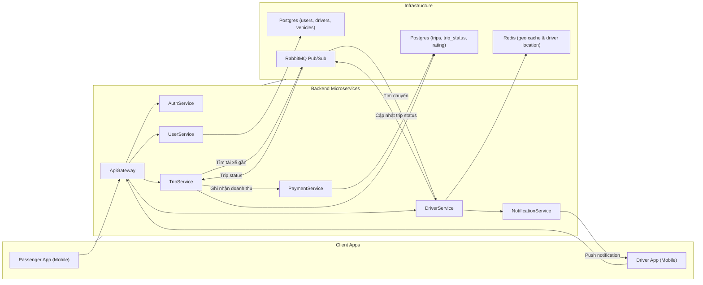

# UIT-Go — ARCHITECTURE.md

**Phiên bản:** v0.1 — Milestone 1 (Demo local)

---

## Mục lục

1. Mục tiêu tài liệu
2. Tóm tắt tiến độ (Milestone 1)
3. Kiến trúc tổng quan
4. Thiết kế chi tiết cho bộ xương microservices

   * AuthService
   * UserService
   * TripService (chứa matching tạm thời)
   * DriverService
5. Giao tiếp giữa các service (sequence flows)
6. Triển khai local (Docker Compose)

   * Cấu trúc repo
   * docker-compose.yml (mô tả)
   * Các container và ports
   * Hướng dẫn chạy demo + kiểm thử nhanh
7. API gợi ý & ví dụ curl để chứng minh giao tiếp

   * UserService
   * TripService
   * DriverService
8. Checklist Milestone 1 (những gì đã hoàn thành)

---

## 1. Mục tiêu tài liệu

Tài liệu này mô tả kiến trúc tổng quan của hệ thống UIT-Go, phiên bản bộ xương (skeleton) cho Milestone 1.

## 2. Tóm tắt tiến độ (Milestone 1)

* Mục tiêu Milestone 1: "Demo bộ xương chạy trên local (Docker Compose)" — các service có thể communicate qua API.
* Trạng thái hiện tại (phiên bản đầu tiên nộp):

  * Docker Compose chạy được gồm các service: `auth-service`, `user-service`, `trip-service`, `driver-service`.
  * Mỗi service có DB riêng (postgres trong compose cho User/Trip, redis geo cache cho Driver).
  * Triển lãm giao tiếp: `api-gateway` có thể gọi `trip-service` (ví dụ: tạo trip), `trip-service` gọi `driver-service` để tìm tài xế gần.
  * File `docker-compose.yml`, scripts start/stop, và sample curl commands đã sẵn sàng trong repo.

> Ghi chú: chi tiết cấu hình, lệnh chạy và API examples nằm trong phần "Triển khai local" và "API gợi ý".

## 3. Kiến trúc tổng quan

(Include diagram: logical services and infra components)



## 4. Thiết kế chi tiết cho bộ xương Microservices

### **AuthService**

**Chức năng chính:**
- Đăng ký và đăng nhập người dùng (JWT Authentication).

**API chính:**
| Method | Endpoint | Mô tả |
|--------|-----------|-------|
| `POST /sessions` | Đăng nhập lấy token |

---

### **UserService**

**Chức năng chính:**
- Đăng ký người dùng hoặc driver.
- Đăng ký hồ sơ tài xế.
- Quản lý hồ sơ cá nhân, phân biệt loại tài khoản: *passenger* và *driver*.
- Cung cấp dữ liệu người dùng cho các service khác (TripService, DriverService) thông qua REST API hoặc event bus.

**Cơ sở dữ liệu:**
- **PostgreSQL**
  - `users`: lưu thông tin cơ bản (id, fullName, email, password, role, phone, created_at)
  - `drivers_profile`: lưu thông tin bổ sung của tài xế (id, user_id, license_number, vehicle_type, vehicleBrand, vehicleModel, licensePlate)

**API chính:**
| Method | Endpoint | Mô tả |
|--------|-----------|-------|
| `POST /users` | Tạo tài khoản mới |
| `GET /users/me` | Lấy thông tin người dùng hiện tại |
| `PUT /users/me` | Cập nhật thông tin người dùng |
| `POST /users/register-driver-profile` | Đăng ký thông tin driver |

---

### **TripService**

**Chức năng chính:**
- Tạo và quản lý chuyến đi (`Trip`), cập nhật trạng thái theo state machine.
- Ghi nhận event (trip_events) để phục vụ tracking và audit log.
- Tạm thời chứa logic *matching driver* (nhưng thực hiện truy vấn danh sách tài xế qua `driver-service`).
- Phát và lắng nghe sự kiện trên RabbitMQ để giao tiếp phi đồng bộ với `driver-service`.
- Rating Trip.

**Cơ sở dữ liệu:**
- **PostgreSQL**
  - `trips`: thông tin chuyến đi (id, passenger_id, driver_id, vehicle_type, origin_lat, origin_lng, destination_lat, destination_lng, estimated_fare, status, created_at, updated_at)
  - `trip_ratings`: đánh giá chuyến đi (id, trip_id, driver_id, passenger_id, rating, feedback, created_at)

**State Machine:**
SEARCHING → ACCEPTED → ENROUTE_TO_PICKUP → IN_PROGRESS → COMPLETED / CANCELLED


**API chính:**
| Method | Endpoint | Mô tả |
|--------|-----------|-------|
| `GET /trips/:id` | Lấy thông tin chi tiết chuyến đi (yêu cầu userId trong JWT) |
| `POST /trips` | Tạo chuyến đi mới (public, sử dụng `CreateTripDto`) |
| `POST /trips/:id/cancel` | Hành khách hủy chuyến |
| `POST /trips/:id/accept` | Tài xế nhận chuyến |
| `POST /trips/:id/complete` | Tài xế hoàn tất chuyến đi |
| `POST /trips/:id/rating` | Hành khách đánh giá chuyến đi |

---

### **DriverService**

**Chức năng chính:**
- Quản lý thông tin và trạng thái hoạt động của tài xế.
- Cập nhật vị trí tài xế theo thời gian thực (Geo location update).
- Tìm kiếm tài xế gần điểm đón thông qua Redis Geo API.
- Giao tiếp với `trip-service` qua RabbitMQ để phản hồi danh sách tài xế tiềm năng.

**Data Store:**
- **Redis (Geo index)**: lưu vị trí tài xế theo `driver:{id} → (longitude, latitude)`
- Mô phỏng tốc độ tìm kiếm thời gian thực cho bản demo.
- Lock tài xế với TTL 15s cho tài xế 15s quyết định nhận chuyến.
- Dễ dàng thay thế sang DynamoDB + Geohash trong môi trường production.

**API chính:**
| Method | Endpoint | Mô tả |
|--------|-----------|-------|
| `PUT /drivers/:id/location` | Cập nhật vị trí GPS của tài xế |
| `PUT /drivers/:id/status` | Cập nhật trạng thái hoạt động (online/offline + loại xe) |
| `GET /drivers/search?lat=&lng=&radius=` | Tìm kiếm tài xế gần vị trí chỉ định (debug hoặc nội bộ TripService gọi) |
| `POST /drivers/reject` | Tài xế từ chối chuyến đi (`driver_reject_trip`) |
| `POST /drivers/accept` | Tài xế chấp nhận chuyến đi (`driver_accept_trip`) |


## 5. Giao tiếp giữa các service (Sequence Flows)

### Luồng tạo chuyến (High-level)

1. **Passenger** gọi `POST /trips` tới **TripService**.
2. **TripService** tạo bản ghi chuyến đi trong cơ sở dữ liệu với trạng thái ban đầu `SEARCHING`.
3. **TripService** publish event **`trip.requested`** lên RabbitMQ, chứa thông tin vị trí đón và loại xe.
4. **DriverService** lắng nghe event **`trip.requested`**, truy vấn Redis Geo index để tìm danh sách tài xế gần nhất.
5. **DriverService** chọn tài xế gần nhất, **lock** tài xế đó và đưa vào danh sách tài xế đã được request.  
   Sau đó gửi **notification** cho tài xế để chọn *Chấp nhận* hoặc *Từ chối* chuyến đi.

   **5.1. Trường hợp tài xế từ chối hoặc không phản hồi sau 15 giây:**
   - **DriverService** retry với tài xế khác.  
     Nếu vượt quá `MAX_RETRY`:
     - Publish event **`driver.timeout`**.
     - Push notification **`trip.failed`** cho Passenger.
   - **TripService** lắng nghe event **`driver.timeout`**, cập nhật trạng thái chuyến đi thành `CANCELLED`.

   **5.2. Trường hợp tài xế chấp nhận chuyến:**
   - **DriverService** gửi event **`driver.accepted`** và push notification cho Passenger.
   - **TripService** lắng nghe event **`driver.accepted`**, cập nhật trạng thái chuyến đi thành `ACCEPTED`.

   **5.3. Trường hợp hành khách hủy chuyến khi vẫn đang tìm tài xế (`SEARCHING`):**
   - **TripService** publish event **`trip.cancel`**.
   - **DriverService** lắng nghe event **`trip.cancel`**, dừng quy trình tìm kiếm tài xế và xóa cache.

---

### Luồng di chuyển & hoàn thành chuyến

10. Khi tài xế bắt đầu di chuyển tới điểm đón, **TripService** cập nhật trạng thái `ENROUTE_TO_PICKUP`.  
11. Khi hành khách lên xe, trạng thái chuyển sang `IN_PROGRESS`.  
12. Khi tài xế hoàn tất chuyến đi, **TripService** cập nhật trạng thái `COMPLETED`.  
13. Nếu hành khách hoặc tài xế hủy chuyến, trạng thái sẽ được cập nhật thành `CANCELLED`.

---

## 6. Triển khai local (Docker Compose)

### Cấu trúc repo mẫu

```
/uit-go-project/
  /apps/
    /api-gateway/
    /auth-service/
    /user-service/
    /trip-service/
    /driver-service/
  /packages/
  docker-compose.yml
  README.md
```

### docker-compose.yml (mô tả)

* api-gateway: build, port 4000
* user-service: build, port 4001
* trip-service: build, port 4002
* driver-service: build, port 4003
* auth-service: build, port 4004
* db-user: postgres:13, volume, port 5432
* db-trip: postgres:13, port 5433
* redis: redis:7 (geo), port 6379
* rabbit-mq: rabbitmq:3-management, port 5672, management UI port 15672

> Lưu ý: ports trong compose để demo local; production sẽ có RDS/ElastiCache.

## 7. API gợi ý & ví dụ curl

**UserService**

* `POST /users` — tạo user
* `POST /sessions` — login
* `GET /users/me` — get profile
* `POST /users/register-driver-profile` - tạo driver profile

Ví dụ:

```
curl -X POST http://localhost:3001/users \
  -H 'Content-Type: application/json' \
  -d '{"email":"u@example.com","password":"P@ssw0rd","role":"PASSENGER"}'
```

**TripService**

* `POST /trips` — tạo trip (tripService sẽ gọi driver-service)
* `GET /trips/{id}` — lấy thông tin trip

**DriverService**

* `PUT /drivers/{id}/location` — cập nhật vị trí
* `GET /drivers/search?lat=&lng=&radius=` — tìm tài xế

## 8. Checklist Milestone 1

* [x] 4 services implemented minimal REST APIs
* [x] Docker Compose to run them locally
* [x] Each service has independent DB in compose
* [x] TripService can call DriverService to find drivers
* [x] ARCHITECTURE.md (this file) initial version produced

---

*Ghi chú:* file này là phiên bản đầu, có thể cập nhật khi nhóm thực hiện các thử nghiệm và có số liệu từ kịch bản load-testing.

***END OF ARCHITECTURE.md***
