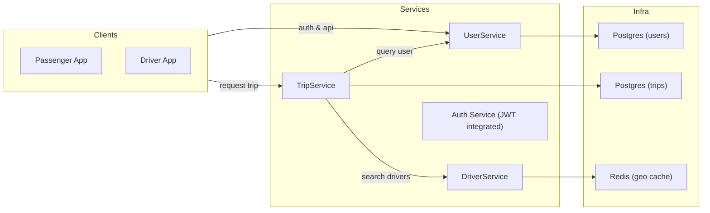

# UIT-Go — ARCHITECTURE.md

**Phiên bản:** v0.1 — Milestone 1 (Demo local)

---

## Mục lục

1. Mục tiêu tài liệu
2. Tóm tắt tiến độ (Milestone 1)
3. Kiến trúc tổng quan
4. Thiết kế chi tiết cho bộ xương microservices

   * UserService
   * TripService (chứa matching tạm thời)
   * DriverService
5. Giao tiếp giữa các service (sequence flows)
6. Triển khai local (Docker Compose)

   * Cấu trúc repo
   * docker-compose.yml (mô tả)
   * Các container và ports
   * Hướng dẫn chạy demo + kiểm thử nhanh
7. API gợi ý & ví dụ curl để chứng minh giao tiếp

   * UserService
   * TripService
   * DriverService
8. Kế hoạch Module A — Scalability & Performance (chi tiết)

   * Mục tiêu / Questions to answer
   * Các lựa chọn kiến trúc và trade-offs (được bảo vệ)
   * Thiết kế đề xuất (stage-by-stage)
   * IaC và môi trường AWS (tóm tắt Terraform)
   * Kịch bản load-testing (k6) và metrics cần thu thập
   * Tối ưu hoá & tuning (cache, autoscaling, DB scaling)
   * Bảng thời gian chi tiết & deliverables
9. Checklist Milestone 1 (những gì đã hoàn thành)
10. Next steps và yêu cầu để demo Milestone 2

---

## 1. Mục tiêu tài liệu

Tài liệu này mô tả kiến trúc tổng quan của hệ thống UIT-Go, phiên bản bộ xương (skeleton) cho Milestone 1, và kế hoạch chuyên sâu cho Module A — Thiết kế cho Scalability & Performance.

## 2. Tóm tắt tiến độ (Milestone 1)

* Mục tiêu Milestone 1: "Demo bộ xương chạy trên local (Docker Compose)" — các service có thể communicate qua API.
* Trạng thái hiện tại (phiên bản đầu tiên nộp):

  * Docker Compose chạy được gồm 3 service: `user-service`, `trip-service`, `driver-service`.
  * Mỗi service có DB riêng (postgres trong compose cho User/Trip, mongo hoặc postgres cho Driver tùy cài đặt).
  * Triển lãm giao tiếp: `UserService` có thể gọi `TripService` (ví dụ: tạo trip), `TripService` gọi `DriverService` để tìm tài xế gần.
  * File `docker-compose.yml`, scripts start/stop, và sample curl commands đã sẵn sàng trong repo.

> Ghi chú: chi tiết cấu hình, lệnh chạy và API examples nằm trong phần "Triển khai local" và "API gợi ý".

## 3. Kiến trúc tổng quan

(Include diagram: logical services and infra components)



## 4. Thiết kế chi tiết cho bộ xương microservices

### UserService

* Chức năng: đăng ký, đăng nhập (JWT), quản lý hồ sơ người dùng (passenger/driver flag).
* DB: PostgreSQL (schema: users, drivers_profile)
* API cơ bản: `POST /users`, `POST /sessions`, `GET /users/me`

### TripService

* Chức năng: tạo trip, quản lý trạng thái, lưu lịch sử trip, tạm thời chứa logic matching (nhưng gọi DriverService để lấy candidate list).
* DB: PostgreSQL (trips, trip_events)
* State machine: `REQUESTED` -> `FINDING_DRIVER` -> `DRIVER_ASSIGNED` -> `ONGOING` -> `COMPLETED`/`CANCELLED`

### DriverService

* Chức năng: quản lý profile tài xế, trạng thái online/offline, cập nhật vị trí realtime (endpoint PUT /drivers/{id}/location), tìm kiếm tài xế gần.
* Data store: Redis (geo) trong Compose để demo speed-first; cung cấp interface để chuyển sang DynamoDB+Geohash ở prod.

## 5. Giao tiếp giữa các service (sequence flows)

### Tạo chuyến (high-level)

1. Passenger gọi `POST /trips` tới TripService.
2. TripService lưu bản ghi tạm (`REQUESTED` -> `FINDING_DRIVER`).
3. TripService gọi `GET /drivers/search?lat=...&lng=...` trên DriverService.
4. DriverService trả về danh sách tài xế gần nhất.
5. TripService chọn 1 candidate, cập nhật trip (`DRIVER_ASSIGNED`) và gọi `POST /drivers/{id}/notifications` (mô phỏng) hoặc publish event.
6. Driver chấp nhận -> TripService cập nhật trạng thái `ONGOING`.

## 6. Triển khai local (Docker Compose)

### Cấu trúc repo mẫu

```
/uit-go/
  /user-service/
  /trip-service/
  /driver-service/
  docker-compose.yml
  README.md
```

### docker-compose.yml (mô tả)

* user-service: build, port 3001
* trip-service: build, port 3002
* driver-service: build, port 3003
* db-user: postgres:13, volume, port 5432
* db-trip: postgres:13, port 5433
* redis: redis:6 (geo)

> Lưu ý: ports trong compose để demo local; production sẽ có RDS/ElastiCache.

### Hướng dẫn chạy demo (tóm tắt)

1. `docker compose up --build`
2. Kiểm tra health: `curl http://localhost:3001/health`, `curl http://localhost:3002/health`, `curl http://localhost:3003/health`
3. Tạo user: `curl -X POST http://localhost:3001/users -d '{...}'`
4. Tạo trip: `curl -X POST http://localhost:3002/trips -d '{pickup,dropoff,userId}'`
5. Quan sát TripService gọi DriverService (logs)

(Chi tiết lệnh có trong phần API gợi ý)

## 7. API gợi ý & ví dụ curl

**UserService**

* `POST /users` — tạo user
* `POST /sessions` — login
* `GET /users/me` — get profile

Ví dụ:

```
curl -X POST http://localhost:3001/users \
  -H 'Content-Type: application/json' \
  -d '{"email":"u@example.com","password":"P@ssw0rd","role":"PASSENGER"}'
```

**TripService**

* `POST /trips` — tạo trip (tripService sẽ gọi driver-service)
* `GET /trips/{id}` — lấy thông tin trip

**DriverService**

* `PUT /drivers/{id}/location` — cập nhật vị trí
* `GET /drivers/search?lat=&lng=&radius=` — tìm tài xế

## 8. Kế hoạch Module A — Scalability & Performance (chi tiết)

### 8.1 Mục tiêu

* Thiết kế hệ thống có khả năng mở tới "hyper-scale" (tỷ request/ngày) cho các flows quan trọng: vị trí driver (writes), tìm driver (reads), tạo trip (writes+coordination).
* Trả lời các câu hỏi: chấp nhận trade-offs nào để đảm bảo trải nghiệm? Khi nào tách MatchingService?

### 8.2 Các lựa chọn kiến trúc & trade-offs (tóm tắt và biện hộ)

1. **Giao tiếp đồng bộ REST vs gRPC vs Event-driven**

   * Quyết định: sử dụng **REST** cho public API (simplicity for demo), **gRPC**/internal or event-driven cho các flows nội bộ latency-sensitive (ví dụ: matching event). Đối với Module A, đề xuất **kết hợp**: TripService -> DriverService via async (SQS/Kafka) để absorb spikes, còn realtime tìm kiếm vị trí dùng sync call to Redis for low latency.
   * Trade-off: Async giúp resilience under spike but increases end-to-end latency.

2. **Geo data: Redis Geo vs DynamoDB+Geohash**

   * Quyết định: cho giai đoạn production-scale, **hybrid**: ingest vị trí liên tục vào DynamoDB (write-optimised) + periodically update coarse-grained Redis hot-cache for low-latency searches.
   * Trade-off: complexity + cost vs latency.

3. **Matching**

   * Quyết định: tách MatchingService khi matching logic phức tạp (multi-criteria), hiện stage: put matching into TripService but implement via message queue to DriverService for scaling.
   * Trade-off: coupling vs operational complexity.

### 8.3 Thiết kế đề xuất (stage-by-stage)

* Stage 0 (current): TripService includes matching sync call to DriverService backed by Redis (demo).
* Stage 1: Introduce async queue (SQS / Kafka). TripRequest -> placed on queue -> Matching worker(s) consume, query cached Redis, publish DriverAssigned event.
* Stage 2: Dedicated Matching service with autoscaling, ML/ranking, circuit breakers.

### 8.4 IaC & AWS mapping (tóm tắt)

* VPC, subnets, SGs via Terraform
* ECS/EKS for container orchestration (ECS Fargate recommended for simplicity), RDS instances for user/trip DBs, ElastiCache Redis for geo, SQS/Kinesis or MSK for event bus.

### 8.5 Kịch bản load-testing (k6)

* Test A: Driver location writes — simulate 100k drivers updating every 30s => write QPS.
* Test B: Passenger trip requests — 10k rps sustained for 5 min (peak simulation) to test queueing/backpressure.
* Test C: Mixed read-heavy search: 50k geo-reads/s against Redis cluster.

**Metrics to collect:** p95/p99 latency, error rate, CPU/memory, Redis QPS/latency, DB connection pool saturation, queue backlog.

### 8.6 Tối ưu hoá đề xuất

* Redis cluster with partitioned geo keys (per city/region) to avoid hotkeys.
* Use read-replicas for RDS, connection pooling, statement caching.
* Autoscaling policies: CPU & custom metric e.g., queue length.
* Rate-limiting / graceful degradation: return ETA approximation from cached snapshot.

### 8.7 Bảng thời gian chi tiết & deliverables

* Week 1: Complete skeleton, Docker Compose demo (Milestone 1) — DONE
* Week 2: Implement async queue prototype, basic load tests (k6)
* Week 3: Tune caching & autoscaling, run comparative load tests
* Week 4: Final report with charts, trade-off write-up, final ARCHITECTURE.md v1.0

## 9. Checklist Milestone 1

* [x] 3 services implemented minimal REST APIs
* [x] Docker Compose to run them locally
* [x] Each service has independent DB in compose
* [x] TripService can call DriverService to find drivers
* [x] ARCHITECTURE.md (this file) initial version produced

## 10. Next steps & yêu cầu cho demo Milestone 2

* Tách Matching thành worker/ngày queue
* Thiết lập basic monitoring (Prometheus + Grafana) in local or cloud
* Implement read replicas and run before/after load tests

---

*Ghi chú:* file này là phiên bản đầu, có thể cập nhật khi nhóm thực hiện các thử nghiệm và có số liệu từ kịch bản load-testing.

***END OF ARCHITECTURE.md***
