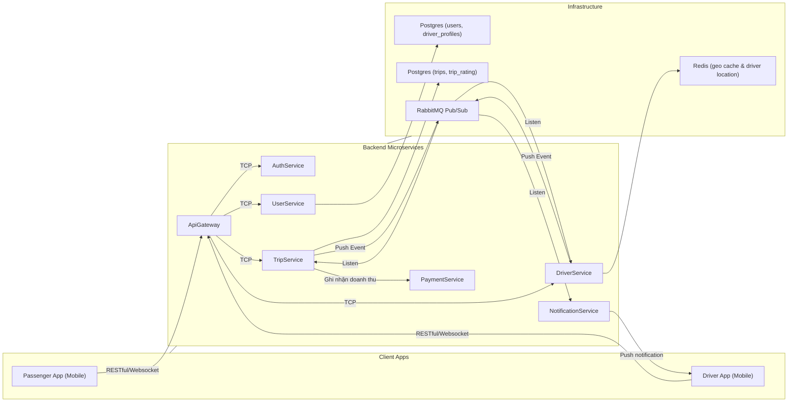
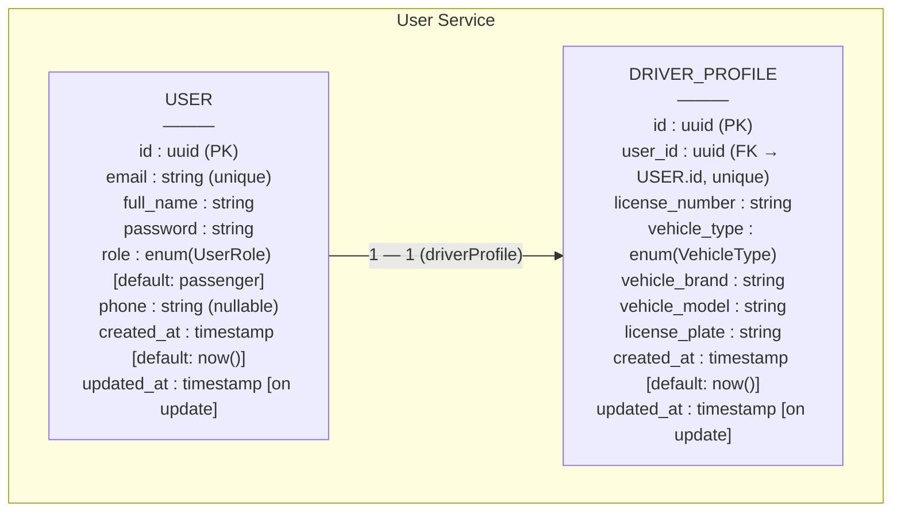
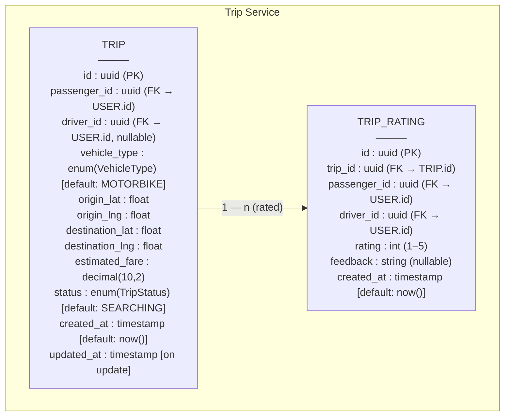

# UIT-Go — ARCHITECTURE.md

**Phiên bản:** v0.2 — Milestone 1 (Demo local)

---

## 1. Mục tiêu tài liệu
Tài liệu này trình bày **kiến trúc hệ thống tổng thể** của UIT-Go trong giai đoạn Milestone 1, nhằm mô tả các **thành phần chính, cơ sở dữ liệu, và các đặc tính phi chức năng (NFR)** của hệ thống.  
Phiên bản này tập trung vào việc triển khai bản **"bộ xương microservices"** có thể chạy trên local bằng Docker Compose.

---

## 2. Tổng quan kiến trúc hệ thống

### 2.1. Mô tả tổng quan
UIT-Go là nền tảng kết nối hành khách và tài xế theo mô hình **microservices**, gồm các service chính:
- **AuthService** – xác thực, cấp JWT.
- **UserService** – quản lý người dùng (passenger & driver profile).
- **TripService** – quản lý chuyến đi, trạng thái, và điều phối tài xế.
- **DriverService** – lưu vị trí, trạng thái tài xế, tìm tài xế gần nhất.
- **(Bổ sung)**: RabbitMQ, Redis Geo, PostgreSQL cho từng service.

Tất cả các service giao tiếp qua **REST API** và **event bất đồng bộ (RabbitMQ)**, được điều phối qua **Docker Compose**.

---

### 2.2. Sơ đồ kiến trúc tổng thể

(Include diagram: logical services and infra components)

---
## 3. Data Schema
### 3.1 User-service schema

### 3.2. Trip-service schema

## 4. Thiết kế chi tiết cho bộ xương Microservices

### **AuthService**

**Chức năng chính:**
- Đăng ký và đăng nhập người dùng (JWT Authentication).

**API chính:**
| Method | Endpoint | Mô tả |
|--------|-----------|-------|
| `POST /sessions` | Đăng nhập lấy token |

---

### **UserService**

**Chức năng chính:**
- Đăng ký người dùng hoặc driver.
- Đăng ký hồ sơ tài xế.
- Quản lý hồ sơ cá nhân, phân biệt loại tài khoản: *passenger* và *driver*.
- Cung cấp dữ liệu người dùng cho các service khác (TripService, DriverService) thông qua REST API hoặc event bus.

**Cơ sở dữ liệu:**
- **PostgreSQL**
  - `users`: lưu thông tin cơ bản (id, fullName, email, password, role, phone, created_at)
  - `drivers_profile`: lưu thông tin bổ sung của tài xế (id, user_id, license_number, vehicle_type, vehicleBrand, vehicleModel, licensePlate)

**API chính:**
| Method | Endpoint | Mô tả |
|--------|-----------|-------|
| `POST /users` | Tạo tài khoản mới |
| `GET /users/me` | Lấy thông tin người dùng hiện tại |
| `PUT /users/me` | Cập nhật thông tin người dùng |
| `POST /users/register-driver-profile` | Đăng ký thông tin driver |

---

### **TripService**

**Chức năng chính:**
- Tạo và quản lý chuyến đi (`Trip`), cập nhật trạng thái theo state machine.
- Ghi nhận event (trip_events) để phục vụ tracking và audit log.
- Tạm thời chứa logic *matching driver* (nhưng thực hiện truy vấn danh sách tài xế qua `driver-service`).
- Phát và lắng nghe sự kiện trên RabbitMQ để giao tiếp phi đồng bộ với `driver-service`.
- Rating Trip.

**Cơ sở dữ liệu:**
- **PostgreSQL**
  - `trips`: thông tin chuyến đi (id, passenger_id, driver_id, vehicle_type, origin_lat, origin_lng, destination_lat, destination_lng, estimated_fare, status, created_at, updated_at)
  - `trip_ratings`: đánh giá chuyến đi (id, trip_id, driver_id, passenger_id, rating, feedback, created_at)

**State Machine:**
SEARCHING → ACCEPTED → ENROUTE_TO_PICKUP → IN_PROGRESS → COMPLETED / CANCELLED

**API chính:**
| Method | Endpoint | Mô tả |
|--------|-----------|-------|
| `GET /trips/:id` | Lấy thông tin chi tiết chuyến đi (yêu cầu userId trong JWT) |
| `POST /trips` | Tạo chuyến đi mới (public, sử dụng `CreateTripDto`) |
| `POST /trips/:id/cancel` | Hành khách hủy chuyến |
| `POST /trips/:id/accept` | Tài xế nhận chuyến |
| `POST /trips/:id/complete` | Tài xế hoàn tất chuyến đi |
| `POST /trips/:id/rating` | Hành khách đánh giá chuyến đi |

---

### **DriverService**

**Chức năng chính:**
- Quản lý thông tin và trạng thái hoạt động của tài xế.
- Cập nhật vị trí tài xế theo thời gian thực (Geo location update).
- Tìm kiếm tài xế gần điểm đón thông qua Redis Geo API.
- Giao tiếp với `trip-service` qua RabbitMQ để phản hồi danh sách tài xế tiềm năng.

**Data Store:**
- **Redis (Geo index)**: lưu vị trí tài xế theo `driver:{id} → (longitude, latitude)`
- Mô phỏng tốc độ tìm kiếm thời gian thực cho bản demo.
- Lock tài xế với TTL 15s cho tài xế 15s quyết định nhận chuyến.
- Dễ dàng thay thế sang DynamoDB + Geohash trong môi trường production.

**API chính:**
| Method | Endpoint | Mô tả |
|--------|-----------|-------|
| `PUT /drivers/:id/location` | Cập nhật vị trí GPS của tài xế |
| `PUT /drivers/:id/status` | Cập nhật trạng thái hoạt động (online/offline + loại xe) |
| `GET /drivers/search?lat=&lng=&radius=` | Tìm kiếm tài xế gần vị trí chỉ định (debug hoặc nội bộ TripService gọi) |
| `POST /drivers/reject` | Tài xế từ chối chuyến đi (`driver_reject_trip`) |
| `POST /drivers/accept` | Tài xế chấp nhận chuyến đi (`driver_accept_trip`) |

## 5. Giao tiếp giữa các service (Sequence Flows)

### Luồng tạo chuyến (High-level)

1. **Passenger** gọi `POST /trips` tới **TripService**.
2. **TripService** tạo bản ghi chuyến đi trong cơ sở dữ liệu với trạng thái ban đầu `SEARCHING`.
3. **TripService** publish event **`trip.requested`** lên RabbitMQ, chứa thông tin vị trí đón và loại xe.
4. **DriverService** lắng nghe event **`trip.requested`**, truy vấn Redis Geo index để tìm danh sách tài xế gần nhất.
5. **DriverService** chọn tài xế gần nhất, **lock** tài xế đó và đưa vào danh sách tài xế đã được request.  
   Sau đó gửi **notification** cho tài xế để chọn *Chấp nhận* hoặc *Từ chối* chuyến đi.

   **5.1. Trường hợp tài xế từ chối hoặc không phản hồi sau 15 giây:**
   - **DriverService** retry với tài xế khác.  
     Nếu vượt quá `MAX_RETRY`:
     - Publish event **`driver.timeout`**.
     - Push notification **`trip.failed`** cho Passenger.
   - **TripService** lắng nghe event **`driver.timeout`**, cập nhật trạng thái chuyến đi thành `CANCELLED`.

   **5.2. Trường hợp tài xế chấp nhận chuyến:**
   - **DriverService** gửi event **`driver.accepted`** và push notification cho Passenger.
   - **TripService** lắng nghe event **`driver.accepted`**, cập nhật trạng thái chuyến đi thành `ACCEPTED`.

   **5.3. Trường hợp hành khách hủy chuyến khi vẫn đang tìm tài xế (`SEARCHING`):**
   - **TripService** publish event **`trip.cancel`**.
   - **DriverService** lắng nghe event **`trip.cancel`**, dừng quy trình tìm kiếm tài xế và xóa cache.

---

### Luồng di chuyển & hoàn thành chuyến

10. Khi tài xế bắt đầu di chuyển tới điểm đón, **TripService** cập nhật trạng thái `ENROUTE_TO_PICKUP`.  
11. Khi hành khách lên xe, trạng thái chuyển sang `IN_PROGRESS`.  
12. Khi tài xế hoàn tất chuyến đi, **TripService** cập nhật trạng thái `COMPLETED`.  
13. Nếu hành khách hoặc tài xế hủy chuyến, trạng thái sẽ được cập nhật thành `CANCELLED`.

---

## 6. Non-Functional Requirements (NFRs)
| **Thuộc tính**      | **Thách thức**                            | **Giải pháp thiết kế**                                                                                   |
| ------------------- | ----------------------------------------- | -------------------------------------------------------------------------------------------------------- |
| **Scalability**     | Xử lý hàng nghìn request đặt xe đồng thời | Mỗi service độc lập (Database per Service), scale riêng lẻ qua Docker/ECS; RabbitMQ để giảm tải đột biến |
| **Latency**         | Đảm bảo phản hồi <200ms khi tìm tài xế    | Redis Geo API cho truy vấn vị trí nhanh, cache dữ liệu ít thay đổi                                       |
| **Availability**    | Duy trì hoạt động liên tục 24/7           | Multi-container deployment, health check tự động, retry & reconnect                                      |
| **Reliability**     | Không mất yêu cầu trong khi tải cao       | RabbitMQ lưu trữ message khi service tạm ngắt kết nối                                                    |
| **Maintainability** | Dễ mở rộng và thay thế module             | Tách codebase per service, REST interface rõ ràng, cấu hình độc lập                                      |

---

***END OF ARCHITECTURE.md***
