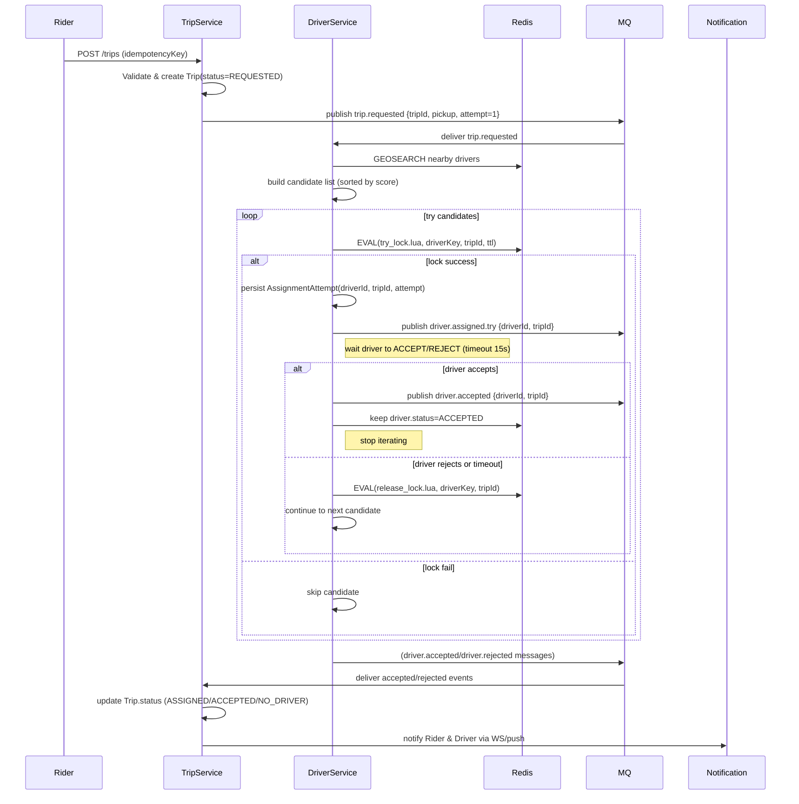

# 🚕 Luồng Hoạt Động Đặt Chuyến (Ride Request Flow - Updated 2025)

## 1️⃣ Rider gửi yêu cầu đặt chuyến

**Luồng:**

- Người dùng mở app → bấm “Đặt xe”.
- Ứng dụng gọi API:

```http
POST /trips
```

→ Gateway → `trip-service`.

**Xử lý trong `trip-service`:**
- Validate thông tin (pickup, destination, payment, …)
- Tạo bản ghi Trip (`status = REQUESTED`, có `idempotencyKey` nếu có)
- Gửi message `trip.requested` đến `driver-service` (qua RabbitMQ).

---

## 2️⃣ `driver-service` tìm tài xế phù hợp

- Nhận sự kiện `trip.requested`
- Gọi `findNearbyDrivers(pickupLocation)` từ **Redis GEO**
- Duyệt danh sách tài xế gần nhất:
  - Dùng Lua `SET NX PX` để **lock tài xế** (giá trị = `tripId`).
  - Nếu **lock thành công** → gán tài xế đó, publish `driver.assigned.try`
  - Nếu **lock thất bại** → bỏ qua (tài xế đang bận).

**Khi gán được tài xế:**
- Cập nhật `driver.status = BUSY` (Redis)
- Đợi phản hồi tài xế (15s)
- Nếu **accept** → gửi `driver.accepted`
- Nếu **reject / timeout** → `release_lock.lua` → tiếp tục tài xế kế tiếp.

---

## 3️⃣ `trip-service` cập nhật chuyến đi

- Nhận thông tin tài xế được gán  
- Cập nhật:

```text
Trip.status = ASSIGNED
Trip.driverId = <driverId>
```

- Gửi **WebSocket notification** đến:
  - Rider: “Đã tìm thấy tài xế”
  - Driver: “Bạn có chuyến mới”

---

## 4️⃣ Driver phản hồi chuyến đi

- Nếu **chấp nhận**:

```http
PATCH /driver/trip/{tripId}/accept
```

→ `driver-service` gửi `"driver.accepted"`  
→ `trip-service` cập nhật `Trip.status = ACCEPTED`.

- Nếu **từ chối**:
  - `release_lock.lua` nếu value khớp
  - Thử tài xế kế tiếp trong danh sách

---

## 5️⃣ Trong quá trình di chuyển

- `driver-service` nhận `updateLocation` định kỳ (2–5s/lần)  
  → Cập nhật vào Redis GEO
- `trip-service` nhận broadcast → cập nhật real-time cho Rider (WebSocket).

---

## 6️⃣ Kết thúc chuyến đi

- Khi tài xế báo hoàn thành → `driver-service` gửi `"trip.completed"`

**Xử lý:**

`trip-service`:
- Cập nhật `Trip.status = COMPLETED`
- Tính cước, lưu DB

`driver-service`:
- Cập nhật `driver.status = AVAILABLE`
- Xóa lock nếu còn

---

## 🧩 Sequence Diagram (Mermaid)



---

## 🧱 Tổng kết luồng chính

| Bước | Dịch vụ chính | Mô tả hành động |
|------|----------------|-----------------|
| 1️⃣ | `trip-service` | Nhận yêu cầu tạo chuyến |
| 2️⃣ | `driver-service` | Tìm tài xế gần nhất và lock |
| 3️⃣ | `trip-service` | Cập nhật trạng thái và thông báo |
| 4️⃣ | `driver-service` | Xử lý chấp nhận / từ chối |
| 5️⃣ | `driver-service` + `trip-service` | Theo dõi vị trí real-time |
| 6️⃣ | `trip-service` + `driver-service` | Kết thúc chuyến, cập nhật dữ liệu |

---

## ⚙️ Redis Lock Scripts

**try_lock.lua**
```lua
if redis.call("GET", KEYS[1]) == false then
  redis.call("SET", KEYS[1], ARGV[1], "PX", ARGV[2], "NX")
  return 1
else
  return 0
end
```

**release_lock.lua**
```lua
if redis.call("GET", KEYS[1]) == ARGV[1] then
  return redis.call("DEL", KEYS[1])
else
  return 0
end
```

---

## 💡 Idempotency

- Rider gửi `Idempotency-Key` khi tạo trip.
- `trip-service` lưu `idempotencyKey -> tripId` mapping.
- Nếu key đã tồn tại → trả lại trip cũ, tránh tạo trùng.
